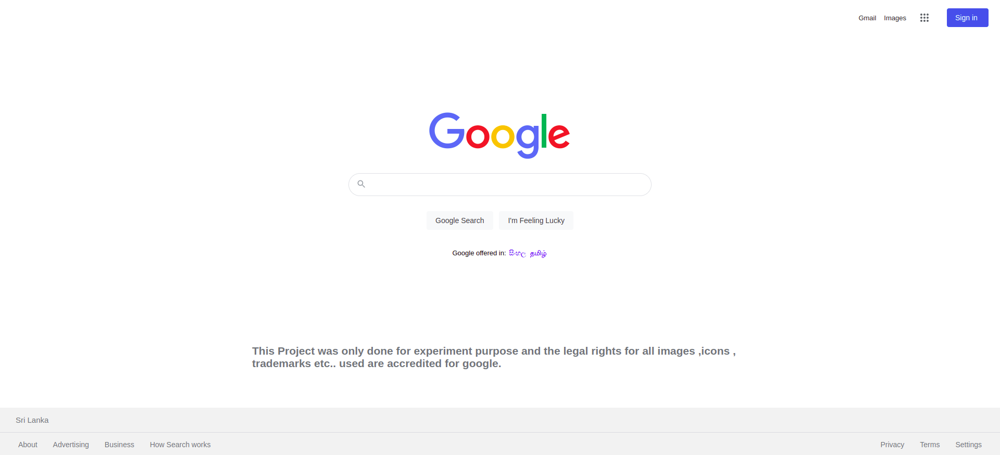
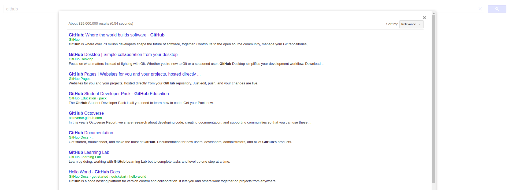

## Google clone with custom search engine

**This project was only done for experiment purpose in order to create a clone application for google.lk with pure html and css and without the aid of any frameworks or libraries. Further more, the application is supported with the google custom search engine feature to enable the search functionality. The legal rights for all images ,icons , trademarks etc.. used are accredited for google.lk .**

### How to use this repo?

1. Clone the repository first  'git clone'

``https://github.com/Chamal-Peiris/google-clone-with-cse.git``

2. Once cloned, open the repository from any prefered text editor

3. Open the index.html page with any prefered browser

## Main  Interface

## Custom search engine 

## Usage

* Simply use the URL provided in order to use this search engine.

### License

Version 1.0.0 , 26 March 2022

Copyright © copy; 2022 Chamal Peiris. All rights reserved.

Licensed under the [MIT](LICENSE) license

## Acknowledgements

* [Choose an Open Source License](https://choosealicense.com)
